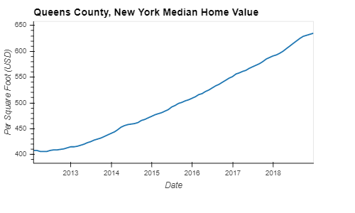
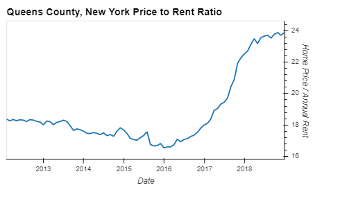
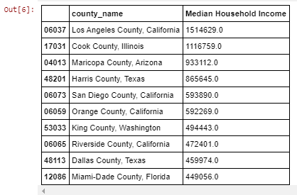
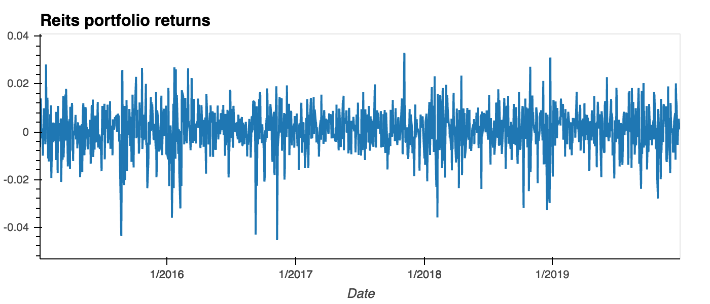
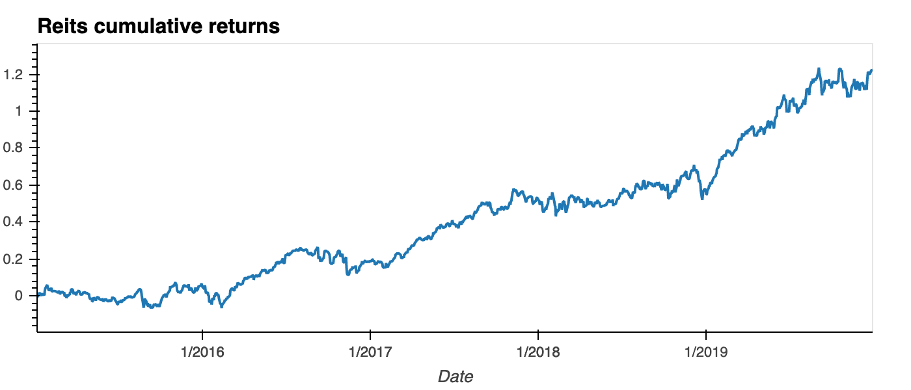
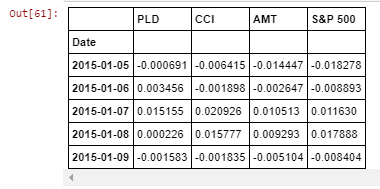
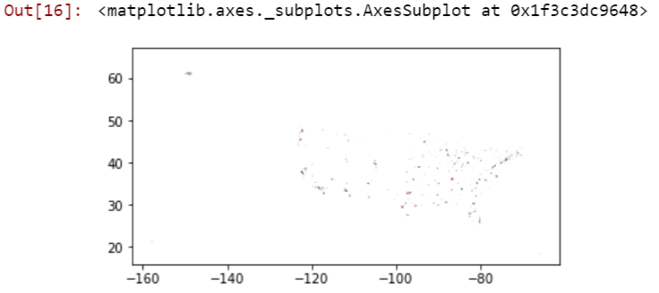

# FinTech Bootcamp Project Name TBD
### Group 2
##### Members
* Aaron Sechler
* Franklin Bueno
* George Cruz
* King Leung
---

# Major Findings for Group Two

## This README file serves as a written summary of major findings. Included are headings for each major question asked of the Group Two data. Also, under each heading is a short description of what Group Two found and any relevant plots/charts/graphs.

## In the attempt to disprove the group of stated null hypotheses, Group Two claimed major findings as it discovered data. Group Two followed a methodology for the acquisition, cleaning, and leverage of data. This methodology is provided.

## Methodology (from Approach Slide of Presentation)

Collect Past Data.
Clean Data.
Analyze Data.
Chart and Organize Past Data.
Leverage Indicators and Indicator Data for Comparison of Data/Assessment of Hypothesis.
Form Interactive Dashboard with Indicators.

## During each step in the methodology, Group Two probed the process with a question and found a major finding as an answer.

## Collect Past Data.
Group Two collected data that fit the context of the hypotheses. The main null hypothesis for this project is that investing in real estate ownership does not result in greater returns than investing in any combination of REITs or conventional stock indices. In the endeavor to find the ideal real estate market, there are at least two ancillary hypotheses. One ancillary hypothesis is that population density does not have any relationship with real estate property values. Another ancillary hypothesis is that median household income does not have any relationship with real estate property values. These three hypotheses served as the main questions to answer as Group Two collected data.

For real estate property data, Group Two found data from several sources, including census.gov, zillow.com, and quandl.com.

For data for Standard & Poor's 500 (500), REITs, and Vanguard, Group Two retrieved data from finance.yahoo.com.

## Clean Data.

As Group Two collected its data, Group Two constantly scrutinized the quality of its data. Occasionally, Group Two found data that did not fit expectations. One such finding was the anomalous price to rent ratios that had New York County (Manhattan) having a lower price to rent ratio than Queens County. In this cleaning stage, Group Two had to confront a major question. How does one manage data that does not make sense?

Group Two looked for significant changes in data entries, outliers, and anomalous data entries; Group Two excluded these entries.

## Analyze Data.

Group Two continued its data analysis as it collected and cleaned data. Throughout these processes, Group Two kept the focus on the questions and hypotheses. In this discrete data analysis step, Group Two considered questions about population, population density, and median household income. 

Group Two considered how results aligned or conflicted with preconceived notions and guesses.

## Chart and Organize Past Data.

After the collection and analysis of data, Group Two charted and organized the data. In this stage, Group Two wanted to have an understanding of returns of investment vehicles from the past to the current point. As Group Two charted and organized data, at least one question dominated the focus of the work. What are the returns from investment vehicles to this point?

.png)

With this data, Group Two was able to compose a map.

## Leverage Indicators and Indicator Data for Comparison of Data/Assessment of Hypothesis.

Group Two was able to gather data for several categories. The data gathered includes data for household income by county. Also, gathered data includes population. For each of these two data categories, the unit is the US county. At this point, the main questions for Group Two shifted. How does the data appear visually? What are the US counties that have the both the highest household income and the greatest population density?

Group Two was able to provide a graphical map representation of household income and population density.

## Form Interactive Dashboard with Indicators.

Group Two formed an interactive dashboard based on the indicators. This dashboard is provided.

